# How to write APA papers using Google Docs

## TL;DR

There is a Google Docs Template which will do some of the ugly formatting _and_ reference magic needed to write an APA paper.

## Introduction

So, you're enrolled in a course where you are required to submit homework in APA format?  No fear, if you want to use Google Docs, there is some help available!

(Yes, Microsoft Word has something similar, you should read the [Microsoft Word](../Word_Template/) version of this guide for more info)

## Step 1 - Create a new doc with the template

(Look, this isn't as powerful or opinionated as the Word version, and Yes, you _will_ need to fenangle things a bit, but this _will_ work (and if you export to PDF nobody will know it was a Google Doc))

First, you need to create a new document.  Note that if you haven't used it before, you will need to select the template from the Template Gallery.  I have only used the 7th Edition version.

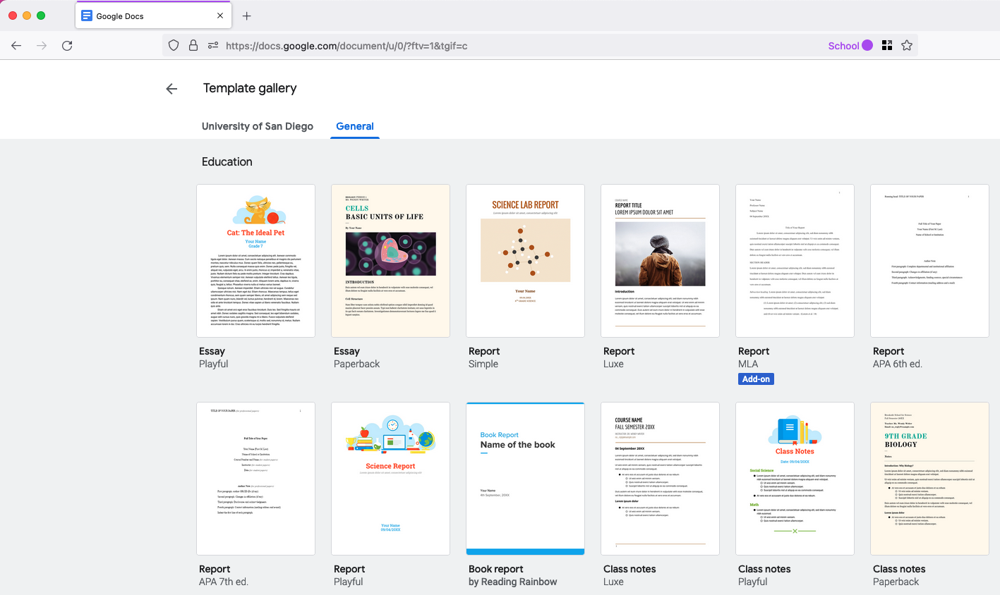

## Step 2 - Populate The Template - Page 1

Now you are on the first page.  You can see a bunch of laid out text for you: all you have to do is fill out what you want and delete the rest!

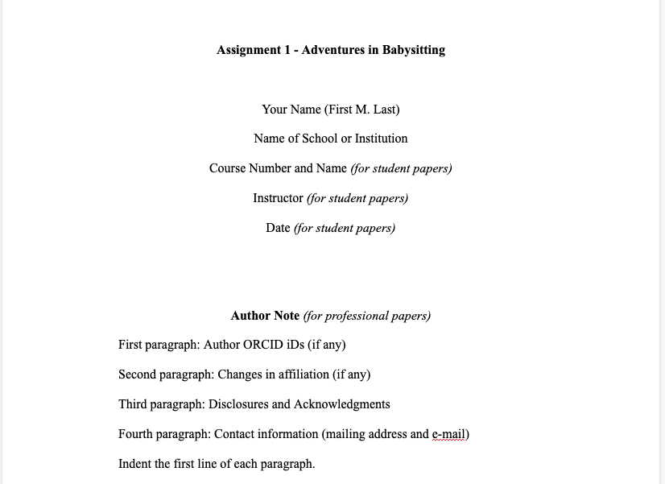

## Step 3 - Sections of the Document

Now you can proceed through the document.  You can completely delete any section you don't want, but here is the layout:
1. Title Page
2. Abstract
3. Body of report, starting with an introduction (intro has no separate title, but repeats the title from page 1)
4. Restuls
5. References

For most of mine, I usually don't have Results, and the abstract is only there if it will be a long paper, so those get deleted.

**NOTE** : Yes, the template doesn't include a Table of Contents but you can insert one pretty easily.

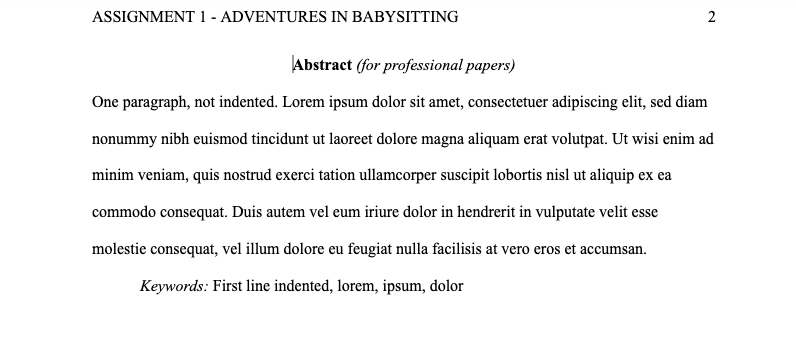

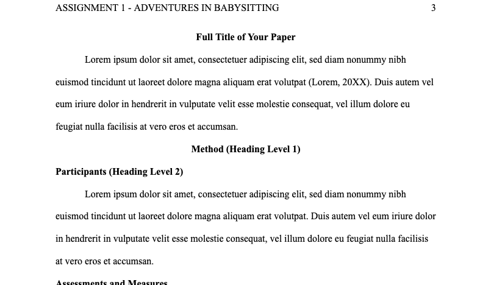

## Step 4 - Track your references

One of the most annoying and silly parts of APA format is tracking references.  They have specific formatting rules, you have to use them all over the place, etc.

Well, Google Docs will do that for you!  It can even auto-populate the dang reference if you just give it a URL!!!! Note the References section:

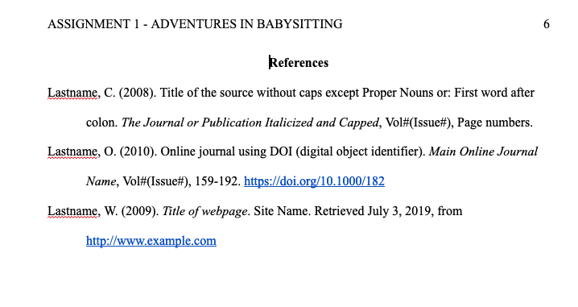

You can manage the contents of your References list in the Citation Manager:

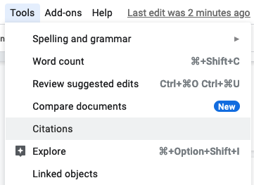

If you want to add a new one, just add it and you can decide what type of citation it is.  Note that there aren't many options but most of mine are websites anyways, so it worked out OK:
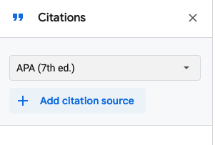

And if you paste a URL it will try to populate all the fields for you:

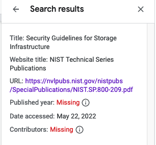

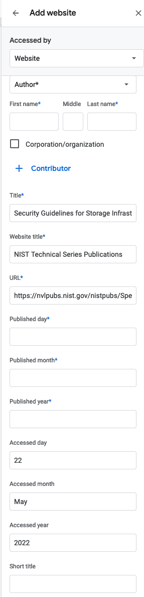

So then you just fill in whatever was missing and you can save it:

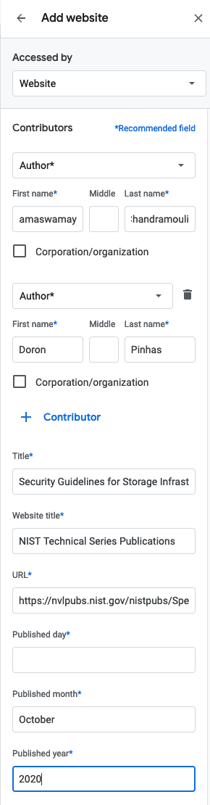

Then click the Cite button wherever you want to reference it in your doc:
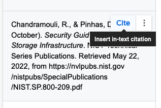

To update the references section, select all of it, then press "Insert References" and it will replace your highlighted text with the entire references section, fully formatted.

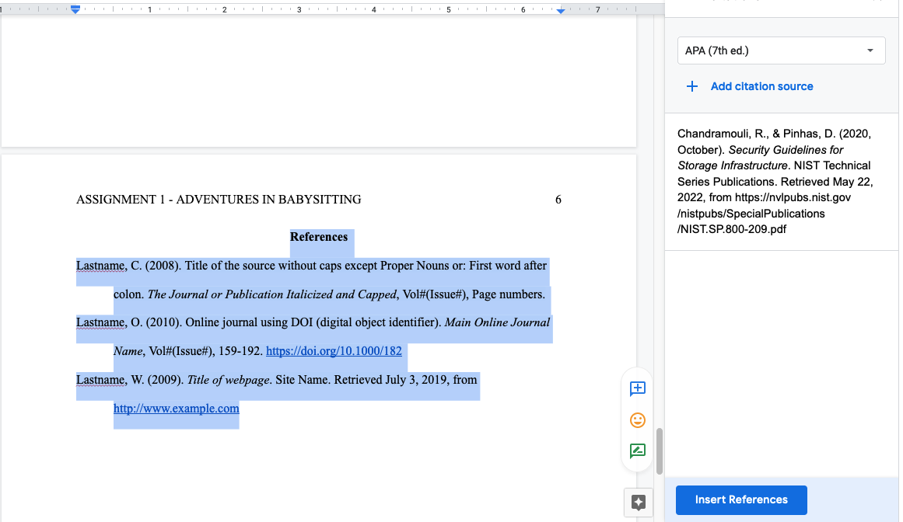

## Special Considerations - Group work

If you create a folder on Google Drive and then put things like inline images into that folder and share it with your group, everyone will be able to work with the document REALLY EASILY.  This is, by far, the best reason to use Google Docs when submitting homework.

## Special Considerations - Inline Graphics

Unlike Word, you _still_ can't properly label images with a caption in Google Docs.  Instead, just add a line of text underneath the image, then after you are done, adjust the spacing for the image and caption text to be centered and single-spaced (leaving the rest of the doc double spaced) and it will look "OK".  Not great, but it's Google Docs, whatcha gonna do?
