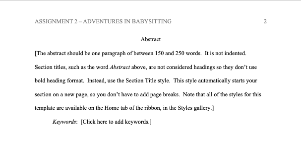

# How to write APA papers using Microsoft Word

## TL;DR

There is a Microsoft Word Template which will do all of the ugly formatting _and_ reference magic needed to write an APA paper.

## Introduction

So, you're enrolled in a course where you are required to submit homework in APA format?  No fear, if you want to use Microsoft Word, you can do this easily!

(Yes, Google Docs has something similar, you should read the Google Docs version of this guide for more info)

## Step 1 - Get the Template

(Yes, I am using a Mac.  No, I am not a fan of Microsoft Office.  Yes, the professor asked us to submit our assignments to Blackboard in .docx format.)

First, you need to create a new document.

Note that APA likely isn't on the list.  Select "More Templates" and in the search field, enter "apa".  The APA (6th Edition) one seems to work best!

**NOTE**: If you don't have it, you can download it from Microsoft [here](https://templates.office.com/en-us/APA-style-report-6th-edition-TM03982351)

## Step 2 - Populate The Template - Page 1

Now you are on the first page.  You can see a bunch of laid out fields for you: all you have to do is fill them out!

Double Click in the header and you can populate with the title: note it will auto-capitalize for you, but it is "supposed" to be maximum 50 characters in length (but you can PROBABLY fit more than that).

Next, fill in the front page fields.  Clicl in between the square brackets and you can fill in that field's properties.  It will save these values for later use!

## Step 3 - Sections of the Document

Now you can proceed through the document.  You can completely delete any section you don't want, but here is the layout:
1. Title Page
2. Abstract
3. Body of report, starting with an introduction (intro has no separate title, but repeats the title from page 1)
4. References
5. Footnotes
6. Tables
7. Figures

For most of mine, I usually don't have Footnotes, Tables, Figures, and the abstract is only there if it will be a long paper, so those all get deleted.

**NOTE** : Yes, the template doesn't include a Table of Contents but you can insert one pretty easily.

)

## Step 4 - Track your references

One of the most annoying and silly parts of APA format is tracking references.  They have specific formatting rules, you have to use them all over the place, etc.

Well, Microsoft Word will do that for you!  Note the Bibliography section:

It will get populated with whatever you have in your Citations with the document.  Go to References -> Citations to see what you have!  (The template includes two that you will want to delete with `-`)

You can even store your citations between documents and import them into future documents!  Used that NIST SP-800 references 35 times?  Fill it in once and then just import it to each new assignment!

All you have to do is double click in your text on a citation and it will insert a reference right there, in the right format.  When you get to the end of the doc, you can just "Update References" (the same way you would update a Table of contents) and it will auto-populate the whole section!  EASY PEASY MAC AND CHEESEY!

